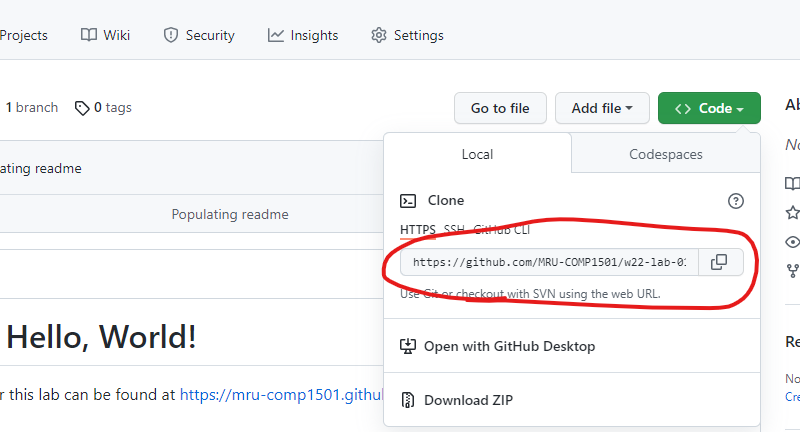
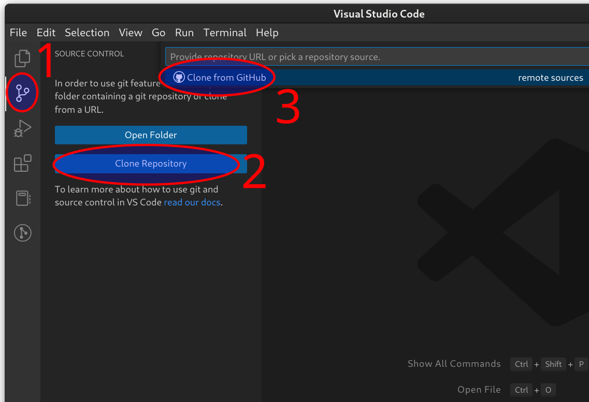
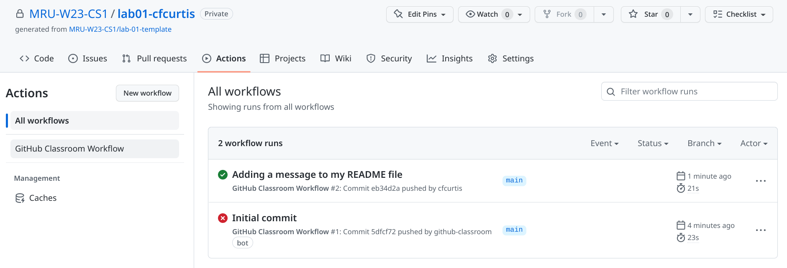

# Intro to Git and GitHub

This lab is due Sept 21

## Introduction
In this course, you will be using [Git](https://git-scm.com/) and [GitHub](https://github.com/) to submit your assignments. This lab introduces you to those tools, as well as the instructional assistants. This is an **autograded lab exercise** worth 1% of your final grade.

If at any point something is not behaving as expected or you get stuck, don't hesitate to ask your instructor, your peers, or the instructional assistants. 

## Objectives
The goals of this lab are to learn how to:
- Accept an assignment invitation from GitHub Classroom
- Clone a repository
- Configure Git on your local computer
- Check the status of your local Git repository
- Add files and stage changes
- Commit with a message
- Push changes back to GitHub
- Get to know the instructional assistants

## Setup
On a lab computer, or on a personal computer where you've **already installed Git and VS Code**, launch [VS Code](https://code.visualstudio.com/).

## Part 1: Clone the starter code for lab 01
1. At the top of this page, click on the "Code" button, then copy the URL from the pop-up window.
    

2. Back in VS Code, take the following steps to clone your repository to your local computer:
   1.  Click on the Source Control icon in the left-hand sidebar (second from the top)
   2.  Select "Clone Repository". This will pop up a bar on the top called the "Command Pallet".
   3.  Select "Clone from GitHub".

    

    This will prompt you to log in to GitHub to authenticate your username. You should only need to do this once for each computer you use. 

3. Paste the URL that you copied in step 3 into the command pallet and hit enter. You should be prompted to select a location to save your new repo - I recommend either your `H:/1701` drive on the lab computers, or a dedicated folder for programming projects on your personal computer.
   > Your H drive is your personal space, so you can log in to any MACO computer and access your files! Each COMP class that you take creates its own folder.

If all goes well, the clone command will execute and download a README.md file into a new folder with the same name as your assignment repository. If you are on a Mac, you will need to generate an [access token](#macos-github-token).

## Part 2: Make and commit changes
1. Open the directory you just cloned in VS Code. You are now working in your git repo and can check your status, commit changes, and push/pull changes to/from GitHub. **You must be "in" this folder for git commands to work**.

2. Open the CHANGEME.md file. It's just a text file, but it renders nicely. You can try clicking the "preview" button  at the top right to see the rendered text, or you can ignore the formatting.

3. Write a message in the CHANGEME file where indicated. **Save your file** - VS Code does not autosave!

4. The "Source Control" button on the left hand side should now show that there are pending changes, like so: . Click on it to open the source control pane.

5. Write a *useful* commit message above the :heavy_check_mark: Commit button, then press "Commit". It will ask if you want to stage all your files - for now you just have one that you changed (right?) so you can go ahead and say yes.

    > The commit message is not the same as the message you wrote in your CHANGEME. The purpose of a commit message is a "note to self" summarizing what changes you made.
   
    > **If you see an error message asking you to setup your git username and email**:
    > - open Git Bash (Windows menu -> search for and open "Git Bash")
    > - enter the command `git config --global user.name "John Doe"` but with your name instead of John Doe
    > - enter the command `git config --global user.email johndoe@example.com` but with your mtroyal email address  

6. The Commit button will change to a "Sync" button, which will first *pull* any changes from GitHub, then *push* your changes back.

> If you'd like to go back and change anything, you can edit files and add/commit/push as many times as you want before the due date. The only thing you cannot change is your commit history and messages.

## Part 3: Verify your changes on GitHub
1. Go back to the URL you copied way back at the beginning of the lab and refresh the page. You should see your new CHANGEME file in all its glory.

2. To make sure you got the autograded points for this lab, click on the "Actions" tab and look for a green check mark next to your commit message. If you see something like the following, you got your 1%!

> In future labs, there will be more than a single test run, so you will probably pass without seeing the green checkmark. GitHub only shows you a checkmark if *all* tests pass.

## References
The [VS Code Git Overview page](
https://code.visualstudio.com/docs/sourcecontrol/overview) has a great summary, including a video. Ignore everything about branching, merging, and pull requests - that's for later when you start collaborating with others.

### Summary of Git commands
If you'd like a stretch challenge, you can do everything we just did on the command line. These are the commands that you used:

`git config`: Edits git configuration on your user profile

`git clone`: Download a copy of a repository to your local computer

`git status`: Show the current state of the git repository

`git add`: Add new files or changes to existing files to the staging area to be committed

`git commit`: take a snapshot of the current state and store it with a message

`git pull`: Retrieve changes from a remote repository 

`git push`: Send changes to a remote repository

## Troubleshooting
### Changes aren't showing on GitHub.com
Make sure that you have done all of the following:

 1. **Save the file** from your text editor.
 2. **Stage** and **Commit** your changes with a message
 3. **Push** your changes (Sync)

 If you still aren't seeing your changes on GitHub, make sure that you don't accidentally have multiple copies of your repo on your local computer. It's easy to accidentally edit one copy while git bash is open in another.

### git commit opened a weird looking window
If you forget the `-m` flag and just execute the command `git commit`, git will launch a text editor. By default, this is a command-line editor called [vim](https://www.vim.org/). Command line editors are really useful and worth learning, but if you want to go back to where you were, do the following:
- Press `Esc` (escape, top-left corner of your keyboard)
- Type `:q!`. That's colon, lowercase "q", then exclamation mark.
- Press `enter`

### macOS GitHub Token
If you are using a Mac, you will need to generate a "Personal access token" from your GitHub account and then use it instead of your password. [Here](https://docs.github.com/en/github/authenticating-to-github/keeping-your-account-and-data-secure/creating-a-personal-access-token) are GitHub's instructions, and [here's](https://www.youtube.com/watch?v=s-CN4RaNq8A) a video that walks through how to use it with the macOS Keychain Access tool. You'll need to check the "repo" box in Scope settings and set the expiry date for at least the end of the semester so you're not having to constantly regenerate it.

After generating a token you can use it instead of your GitHub password in the terminal. Copying and pasting is a bit odd as it will not actually show the text when you paste into a password prompt.
